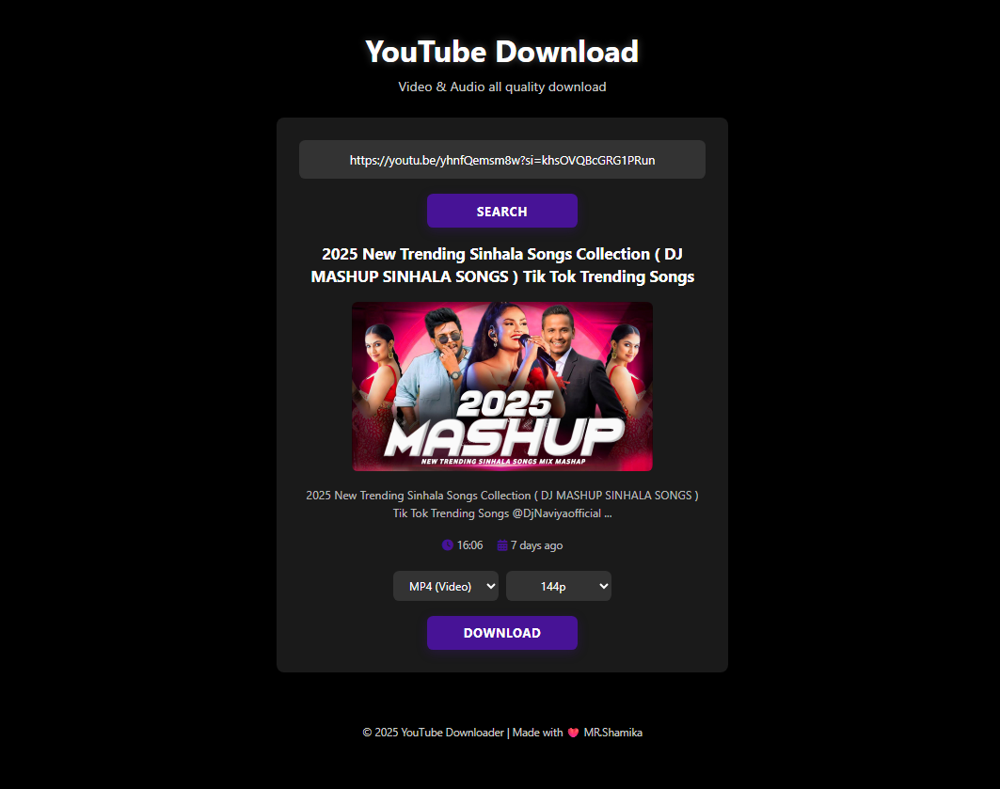
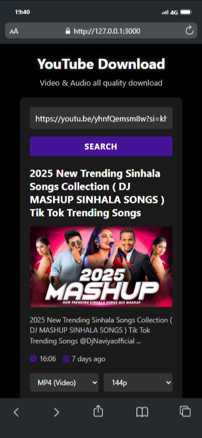

# 🎥 YouTube Video & Audio Downloader

Welcome to the **YouTube Downloader** — a beautiful and fully responsive web app that lets you download **YouTube videos or audio files** in various formats and qualities with ease.

 <!-- Optional: Add a real screenshot here -->

---

## 🌟 Features

- 🔍 Search and preview video metadata (title, thumbnail, duration, etc.)
- 🎞 Download in both **MP4 (video)** and **MP3 (audio)** formats
- 🔽 Choose from multiple quality options (144p - 1080p / 92kbps - 320kbps)
- 🌀 Smooth loader animation during download
- 🌙 Sleek and modern **Dark Mode** UI
- ✅ 100% mobile responsive design

---

## 🚀 Live Demo

> [Click here to view live](https://your-deployment-url.com)  
> *(replace with your actual deployment URL)*

---

## 📸 Screenshots

| Desktop | Mobile |
|--------|--------|
|  |  |

---

## 🔧 How to Use

1. Paste your **YouTube video URL** into the input box.
2. Click **Search**.
3. Choose your **format (Mp4 or Mp3)**.
4. Select the **quality** you prefer.
5. Hit the **Download** button — done! 🎉

---

## 🛠 Tech Stack

- **HTML5**
- **CSS3**
- **Vanilla JavaScript**
- ✅ [Wizard API](https://wizard-api-xi.vercel.app/) (for YouTube downloads)

---

## 📁 Folder Structure

📁 your-project/  
├── index.html  
├── style.css  
├── script.js  
├── README.md  
└── /screenshots/  
  ├── desktop.png  
  └── mobile.png  
